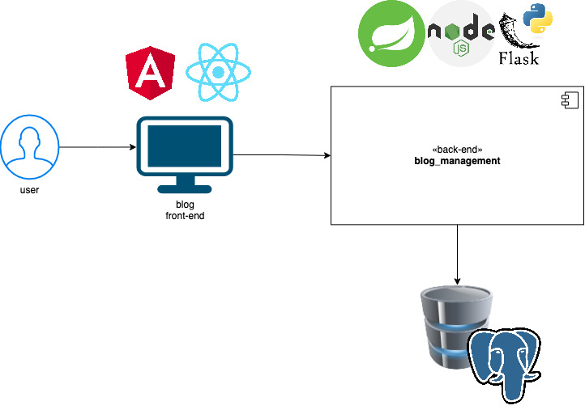
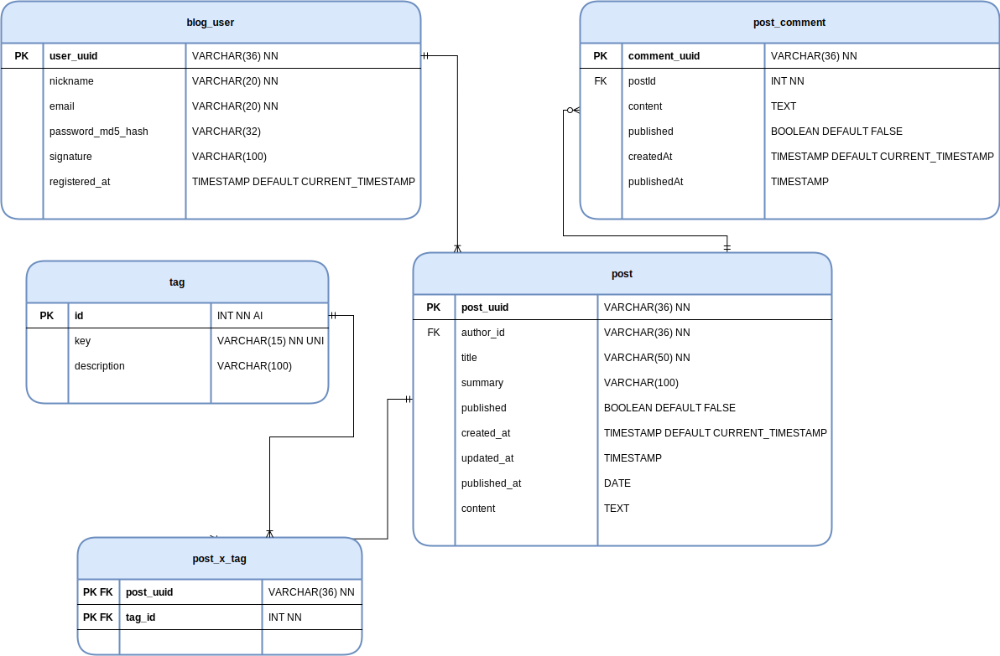
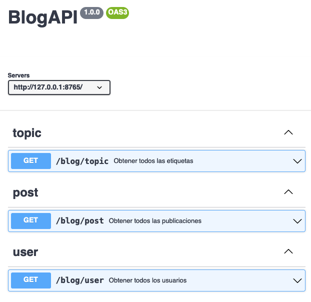

# kata_exercise
Repositorio que contiene el código básico necesario para llevar a cabo la kata.

## Descripción

En este repositorio podrás encontrar la implementación, en múltiples lenguajes, de una solución de software que permite, de una manera rudimentaria, la administración básica de un blog.

Está compuesta por un *front-end* que consume una **API REST**, un *back-end* que expone dicha *API* y una base de datos que almacena la información referente al blog: comentarios, publicaciones, etiquetas y usuarios.

### Modelo Arquitectónico básico

### Base de datos
La solución de software hace uso de **PostgreSQL** como gestor de base de datos, por ello se proporciona tanto un archivo [YAML](blog_db/docker-compose.yaml), con la configuración básica de dicho gestor, como un par de [scripts SQL](blog_db/init/) para realizar la creación de la base de datos como se representan en el siguiente modelo:

De darse el caso se podría cambiar de gestor de base de datos, pero eso implicaría modificaciones tanto en la solución de software como en los scripts proporcionados.

Leer el [Blog BD Readme](blog_db/README.md) para más información.

### OpenAPI Specification (OAS)

Se expondrán de manera predeterminada los siguientes recursos:

| Nombre del recurso        | Descripción           | 
| ------------------------- |:-------------:| 
| `[GET]` /blog/tags         | Permite obtener todas las equiquetas que hay en base de datos      | 
| `[GET]` /blog/comments          | Permite obtener todos los comentarios que hay en base de datos      | 
| `[GET]` /blog/users          | Permite obtener todas los usuarios que hay en base de datos           | 

Para más información sobre las especificaciones de los servicios expuestos revisar el [OpenAPI Specification (OAS)](diagrams/blog_oas.json)

### Instalación y ejecución

Cada una de las distintas implementaciones cuenta con su propio archivo **README.md** con detalles de los requisitos básicos para su instalación y ejecución.