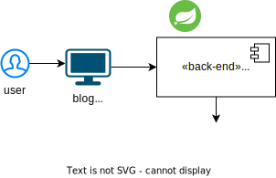

# kata_exercise
Repositorio que contiene el código básico necesario para llevar a cabo la kata.

## Descripción

En este repositorio podrás encontrar la implementación, en múltiples lenguajes, de una solución de software que permite, de una manera rudimentaria, la administración básica de un blog.

Está compuesta por un *front-end* que consume una **API REST**, un *back-end* que expone dicha *API* y una base de datos que almacena la información referente al blog: comentarios, publicaciones, etiquetas y usuarios.

### Modelo Arquitectónico básico

postgresql
se proporciona un docker compose 
* enlace al readme de la BD
si se quiere se puede usar los scripts en una bd propia, pero se debe ajustar el componente
* enlace para los scrips

### OpenAPI Specification (OAS)
tabla con los recursos base
imágen
* enlace al archivo

### Instalación y ejecución

Cada una de las distintas implementaciones cuenta con su propio archivo **README.md** con detalles de los requisitos básicos para su instalación y ejecución.